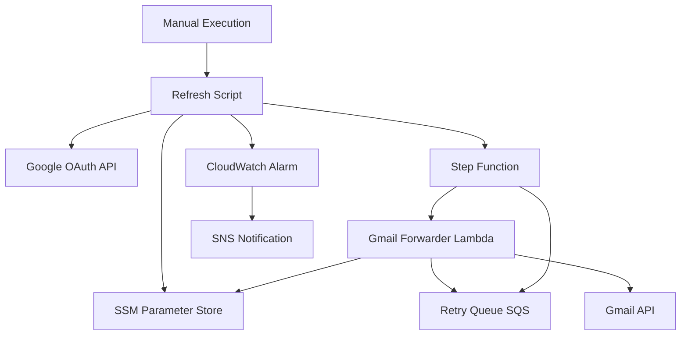

# Design Document

## Overview

This design implements a robust Google OAuth token management system that addresses the 7-day refresh token limitation in Google's testing mode. The solution provides automated token refresh, proactive monitoring, and resilient message queuing to ensure continuous email forwarding service availability.

## Architecture

### High-Level Architecture



### Component Interaction Flow

1. **Token Refresh Flow**: Manual execution of refresh script → retrieves credentials from SSM → opens browser for OAuth consent → stores new refresh token → invokes retry processor Lambda
2. **Email Processing Flow**: Gmail Forwarder retrieves refresh token → generates access token → processes emails → on token expiration, stores complete SES event in retry queue
3. **Monitoring Flow**: CloudWatch alarm automatically triggers when current time approaches token expiration (set by refresh script)
4. **Retry Flow**: Refresh script starts Step Function execution → Step Function reads messages from SQS → invokes Gmail Forwarder Lambda for each message → handles retries and error management automatically

## Components and Interfaces

### 1. Enhanced Refresh Script (Interactive Python Script)

**Purpose**: Interactive script to perform OAuth refresh process using SSM-stored credentials

**Key Functions**:
- `retrieve_oauth_credentials()`: Fetch complete client credentials JSON from SSM
- `perform_interactive_oauth_flow()`: Execute Google OAuth authorization flow with browser interaction
- `store_refresh_token()`: Save new refresh token to SSM
- `trigger_retry_processing()`: Start Step Function execution for retry processing
- `setup_expiration_alarm()`: Create/update CloudWatch alarm for token expiration

**SSM Parameters**:
- `/ses-mail/{environment}/gmail-forwarder/oauth/client-credentials`: Complete Google OAuth client JSON file (SecureString)
- `/ses-mail/{environment}/gmail-forwarder/oauth/refresh-token`: Current refresh token (SecureString)

**Configuration**:
- AWS credentials configured via CLI/environment
- OAuth redirect URI: `http://localhost:8080/callback`
- Temporary local web server for OAuth callback handling
- Script location: `scripts/refresh_oauth_token.py`

### 2. Modified Gmail Forwarder Lambda

**Purpose**: Process emails efficiently while handling token expiration gracefully

**Key Changes**:
- Remove token update logic
- Implement access token caching
- Add retry queue integration
- Enhanced error handling for token expiration

**New Functions**:
- `generate_access_token()`: Create new access token from refresh token for each use
- `queue_for_retry()`: Add failed messages to retry queue
- `is_token_expired_error()`: Detect OAuth expiration errors

**Token Strategy**:
- Generate fresh access token for each email processing session
- No caching - simple and reliable approach
- Handle token expiration by queuing messages for retry

### 3. Token Expiration Monitoring

**Purpose**: Monitor refresh token expiration using CloudWatch alarms based on known expiration time

**Implementation**:
- Refresh script calculates exact expiration time (creation time + 7 days)
- Refresh script creates/updates CloudWatch alarm to trigger 24 hours before expiration
- No Lambda required - pure CloudWatch alarm based on timestamp comparison

**CloudWatch Alarm Configuration**:
- **Alarm Name**: `ses-mail-gmail-forwarder-token-expiring-{environment}`
- **Metric**: Custom metric with token expiration timestamp
- **Condition**: Current time > (expiration_time - 24 hours)
- **Actions**: SNS notification to administrators
- **SNS Topic**: `ses-mail-gmail-forwarder-token-alerts-{environment}`

**Refresh Script Responsibilities**:
- Extract expiration time from the refresh token itself
- Update CloudWatch alarm with new expiration timestamp from token
- Publish one-time metric with expiration time for alarm evaluation

### 4. Retry Queue and Step Function Processing

**Purpose**: Store and process failed email messages after successful token refresh

**SQS Queue Configuration**:
- **Queue Name**: `ses-mail-gmail-forwarder-retry-{environment}`
- **Dead Letter Queue**: `ses-mail-gmail-forwarder-retry-dlq-{environment}`
- **Message Body**: Complete original SES event that failed to process
- **Message Attributes**: 
  - `original_timestamp`: When message first failed
  - `error_type`: Classification of failure (token_expired, rate_limit, etc.)
- **Visibility Timeout**: 15 minutes
- **Message Retention**: 14 days

**Step Function for Retry Processing**:
- **Name**: `ses-mail-gmail-forwarder-retry-processor-{environment}`
- **Trigger**: Invoked by refresh script after successful token refresh
- **Functionality**: 
  - Read all messages from SQS retry queue
  - For each message, invoke Gmail Forwarder Lambda with original SES event
  - Handle retries with exponential backoff (3 attempts max)
  - Move permanently failed messages to dead letter queue
- **Benefits**: AWS handles error handling, retries, and state management

### 5. Enhanced SSM Parameter Management

**Parameter Structure**:
```
/ses-mail/{environment}/gmail-forwarder/oauth/
├── client-credentials (SecureString) - Complete Google OAuth JSON
└── refresh-token (SecureString)
```

**Access Patterns**:
- Refresh Script: Read client credentials, write refresh token, extract expiration from token payload
- Gmail Forwarder: Read refresh token only

## Data Models

### OAuth Token Metadata
```python
@dataclass
class TokenMetadata:
    refresh_token: str
    expires_at: datetime  # Extracted from the refresh token itself
    
    def hours_until_expiration(self) -> float:
        return (self.expires_at - datetime.utcnow()).total_seconds() / 3600
    
    def is_expired(self) -> bool:
        return datetime.utcnow() >= self.expires_at
    
    @classmethod
    def from_refresh_token(cls, refresh_token: str) -> 'TokenMetadata':
        # Extract expiration from JWT token payload
        import jwt
        decoded = jwt.decode(refresh_token, options={"verify_signature": False})
        expires_at = datetime.fromtimestamp(decoded['exp'])
        return cls(refresh_token=refresh_token, expires_at=expires_at)
```

### Retry Queue Message Structure

**SQS Message Body**: Complete original SES event JSON that failed processing
```json
{
  "Records": [
    {
      "eventSource": "aws:ses",
      "eventVersion": "1.0",
      "ses": {
        "mail": {
          "messageId": "...",
          "source": "...",
          "destination": [...],
          "commonHeaders": {...}
        },
        "receipt": {...}
      }
    }
  ]
}
```

**SQS Message Attributes**:
```python
{
    "attempt_count": {"StringValue": "1", "DataType": "Number"},
    "original_timestamp": {"StringValue": "2024-01-01T12:00:00Z", "DataType": "String"},
    "error_type": {"StringValue": "token_expired", "DataType": "String"},
    "original_lambda_request_id": {"StringValue": "abc-123", "DataType": "String"}
}
```

### OAuth Client Credentials
```python
@dataclass
class OAuthCredentials:
    client_id: str
    client_secret: str
    redirect_uris: List[str]
    
    @classmethod
    def from_json(cls, credentials_json: str) -> 'OAuthCredentials':
        data = json.loads(credentials_json)
        installed = data['installed']
        return cls(
            client_id=installed['client_id'],
            client_secret=installed['client_secret'],
            redirect_uris=installed['redirect_uris']
        )
```

## Error Handling

### Token Expiration Scenarios

1. **Refresh Token Expired**:
   - Gmail Forwarder detects 401/403 errors
   - Messages queued for retry
   - CloudWatch alarm triggered
   - Manual intervention required for new OAuth flow

2. **Access Token Expired**:
   - Automatic refresh using stored refresh token
   - Retry failed operation immediately
   - No queuing required for transient failures

3. **OAuth Flow Failures**:
   - Detailed logging of OAuth errors
   - Exponential backoff for retry attempts
   - Alert system administrators after 3 consecutive failures

### Retry Logic

**Exponential Backoff Strategy**:
- Initial delay: 30 seconds
- Multiplier: 2.0
- Maximum delay: 15 minutes
- Maximum attempts: 3

**Failure Categories**:
- **Transient**: Network timeouts, rate limits (retry immediately)
- **Authentication**: Token expiration (queue for later retry)
- **Permanent**: Invalid message format (send to dead letter queue)

## Testing Strategy

### Unit Tests

1. **OAuth Flow Testing**:
   - Mock Google OAuth API responses
   - Test credential retrieval from SSM
   - Validate token storage operations

2. **Token Expiration Logic**:
   - Test expiration calculations
   - Validate metric publishing
   - Test alarm threshold logic

3. **Retry Queue Processing**:
   - Test message queuing and dequeuing
   - Validate retry attempt counting
   - Test exponential backoff implementation

### Integration Tests

1. **End-to-End Token Refresh**:
   - Test complete OAuth flow with test credentials
   - Validate SSM parameter updates
   - Test retry queue triggering

2. **Gmail Forwarder Integration**:
   - Test email processing with valid tokens
   - Test token expiration handling
   - Validate retry queue integration

3. **Monitoring Integration**:
   - Test CloudWatch metric publishing
   - Validate alarm triggering
   - Test EventBridge scheduling

### Performance Testing

1. **Concurrent Access**:
   - Test multiple Lambda invocations accessing SSM
   - Validate token caching effectiveness
   - Test retry queue throughput

2. **Scale Testing**:
   - Test with high email volume
   - Validate retry queue performance under load
   - Test monitoring system scalability

## Security Considerations

### Credential Management

1. **SSM Parameter Security**:
   - Use SecureString type for sensitive parameters
   - Implement least-privilege IAM policies
   - Enable parameter access logging

2. **Token Rotation**:
   - Automatic refresh token rotation every 6 days
   - Secure deletion of expired tokens
   - Audit trail for all token operations

3. **Access Control**:
   - Separate IAM roles for each Lambda function
   - Restrict SSM parameter access by function
   - Enable CloudTrail for all AWS API calls

### API Security

1. **External API Access**:
   - Use HTTPS for all Google API calls
   - Implement proper SSL certificate validation
   - Validate all external API responses

2. **AWS Service Security**:
   - Use IAM roles for service-to-service authentication
   - Enable encryption in transit for all AWS API calls
   - Implement request signing for AWS services

## Deployment Strategy

### Infrastructure as Code

1. **Terraform Resources**:
   - Updated Gmail Forwarder Lambda with proper IAM roles
   - Step Function for retry processing with proper IAM roles
   - SSM parameters with encryption (environment-specific naming)
   - SQS retry queue and dead letter queue (environment-specific naming)
   - SNS topic for token expiration notifications (environment-specific naming)

2. **Script Deployment**:
   - Enhanced refresh script in `scripts/` directory
   - Requirements file for script dependencies
   - Documentation for manual execution process

3. **Environment Configuration**:
   - Separate parameter namespaces per environment
   - Environment-specific OAuth client configurations
   - Staged deployment with rollback capability

### Implementation Plan

1. **Infrastructure Updates**: Add SQS queues and SNS topic with environment-specific naming
2. **Gmail Forwarder Updates**: Modify to use retry queue for token expiration failures
3. **Enhanced Refresh Script**: Create new script that handles complete OAuth flow and retry processing
4. **SSM Parameter Updates**: Store complete client credentials JSON and add token metadata
5. **Monitoring Setup**: Configure CloudWatch alarms for token expiration

## Monitoring and Alerting

### Key Metrics

1. **Token Health**:
   - Hours until refresh token expiration
   - Token refresh success/failure rate
   - Access token generation frequency

2. **Email Processing**:
   - Email forwarding success rate
   - Retry queue depth and processing time
   - Failed delivery count by error type

3. **System Performance**:
   - Lambda execution duration and errors
   - SSM parameter access latency
   - SQS queue processing throughput

### Alert Configuration

1. **Critical Alerts**:
   - Refresh token expires in < 24 hours
   - OAuth flow failures > 3 consecutive attempts
   - Retry queue depth > 100 messages

2. **Warning Alerts**:
   - Access token refresh failures
   - Retry processing delays > 10 minutes
   - Unusual email forwarding error rates

## Operational Procedures

### Token Refresh Process

1. **Manual Refresh Process**:
   - Execute refresh script when CloudWatch alarm triggers
   - Run script every 6 days proactively
   - Emergency execution when token expires

2. **Manual Intervention**:
   - When refresh token expires completely
   - For OAuth client credential updates
   - During security incident response

### Troubleshooting Guide

1. **Common Issues**:
   - OAuth consent screen changes
   - Google API quota exceeded
   - SSM parameter access denied

2. **Recovery Procedures**:
   - Emergency token refresh process
   - Retry queue manual processing
   - System rollback procedures