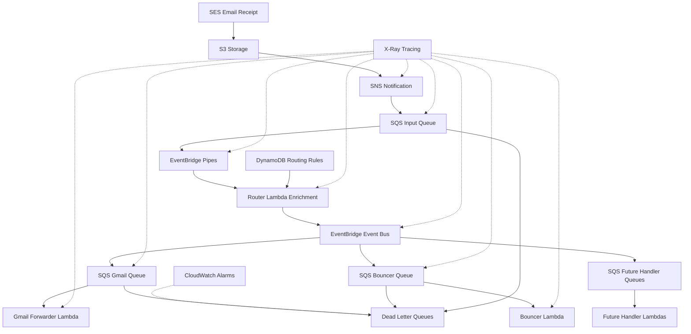

# Design Document

## Overview

This design modernizes the existing SES email processing system by replacing the synchronous validator lambda with a fully event-driven architecture using AWS serverless services. The new system eliminates custom dispatch logic by leveraging EventBridge Pipes for message enrichment and EventBridge Event Bus for intelligent routing to multiple handlers.

The architecture follows a pipeline pattern: **SES → S3 → SNS → SQS → EventBridge Pipes[enrichment=router] → EventBridge Event Bus → SQS(handlers) → Lambda processors**

This design ensures $0 standing costs, comprehensive monitoring with X-Ray tracing, and extensible routing rules stored in DynamoDB.

## Architecture

### High-Level Data Flow



### Component Architecture

#### 1. Email Ingestion Layer
- **SES Receipt Rule**: Stores emails in S3 and publishes to SNS (removes validator lambda)
- **S3 Bucket**: Temporary email storage with lifecycle policies
- **SNS Topic**: Initiates processing pipeline with X-Ray tracing

#### 2. Message Processing Pipeline
- **SQS Input Queue**: Buffers messages from SNS for EventBridge Pipes
- **EventBridge Pipes**: Provides enrichment via router lambda
- **Router Lambda**: Enriches messages with routing decisions from DynamoDB
- **EventBridge Event Bus**: Routes enriched messages to appropriate handler queues

#### 3. Handler Layer
- **SQS Handler Queues**: Separate queues for each processing type (Gmail, Bouncer, etc.)
- **Handler Lambdas**: Process specific actions (reuse existing email_processor logic)

#### 4. Supporting Services
- **DynamoDB**: Stores routing rules with hierarchical address matching
- **X-Ray**: Distributed tracing across the entire pipeline
- **CloudWatch**: Monitoring, alarms, and dead letter queue alerts

## Components and Interfaces

### SES Receipt Rule Configuration
```terraform
resource "aws_ses_receipt_rule" "main" {
  name          = "receive-emails-${var.environment}"
  rule_set_name = aws_ses_receipt_rule_set.main.rule_set_name
  recipients    = var.domain
  enabled       = true
  scan_enabled  = true

  # Store email in S3
  s3_action {
    bucket_name       = aws_s3_bucket.email_storage.id
    object_key_prefix = "emails/"
    position          = 1
  }

  # Publish to SNS (with X-Ray tracing)
  sns_action {
    topic_arn = aws_sns_topic.email_processing.arn
    position  = 2
  }
}
```

### SNS Topic with X-Ray Tracing
```terraform
resource "aws_sns_topic" "email_processing" {
  name = "ses-email-processing-${var.environment}"
  
  # Enable X-Ray tracing
  tracing_config = "Active"
}
```

### EventBridge Pipes Configuration
```terraform
resource "aws_pipes_pipe" "email_router" {
  name     = "ses-email-router-${var.environment}"
  role_arn = aws_iam_role.pipes_execution.arn

  source = aws_sqs_queue.input_queue.arn
  target = aws_cloudwatch_event_bus.email_routing.arn

  enrichment = aws_lambda_function.router_enrichment.arn
  
  # X-Ray tracing
  log_configuration {
    level = "INFO"
  }
}
```

### Router Lambda Enrichment Function
The router lambda receives the original SES event and enriches it with routing decisions:

**Input Message Structure:**
```json
{
  "Records": [{
    "eventSource": "aws:ses",
    "ses": {
      "mail": {
        "messageId": "...",
        "source": "sender@example.com",
        "destination": ["recipient@domain.com"],
        "commonHeaders": {...}
      },
      "receipt": {
        "spamVerdict": {...},
        "virusVerdict": {...},
        "dkimVerdict": {...},
        "spfVerdict": {...}
      }
    }
  }]
}
```

**Enrichment Process:**
1. Extract recipient addresses from SES event
2. For each recipient, perform DynamoDB lookup with address normalization
3. Analyze DMARC/security headers
4. Determine routing actions
5. Return enriched message

**Output Message Structure:**
```json
{
  "originalEvent": { /* Original SES event */ },
  "routingDecisions": [{
    "recipient": "recipient@domain.com",
    "normalizedRecipient": "recipient@domain.com",
    "action": "forward-to-gmail",
    "target": "user@gmail.com",
    "matchedRule": "recipient@domain.com"
  }],
  "emailMetadata": {
    "messageId": "...",
    "source": "sender@example.com",
    "subject": "...",
    "timestamp": "...",
    "securityVerdict": {
      "spam": "PASS",
      "virus": "PASS",
      "dkim": "PASS",
      "spf": "PASS"
    }
  }
}
```

### EventBridge Event Bus Rules
```terraform
resource "aws_cloudwatch_event_rule" "gmail_forwarder" {
  name           = "route-to-gmail-${var.environment}"
  event_bus_name = aws_cloudwatch_event_bus.email_routing.name

  event_pattern = jsonencode({
    "source": ["ses.email.router"],
    "detail": {
      "routingDecisions": {
        "action": ["forward-to-gmail"]
      }
    }
  })
}

resource "aws_cloudwatch_event_rule" "bouncer" {
  name           = "route-to-bouncer-${var.environment}"
  event_bus_name = aws_cloudwatch_event_bus.email_routing.name

  event_pattern = jsonencode({
    "source": ["ses.email.router"],
    "detail": {
      "routingDecisions": {
        "action": ["bounce"]
      }
    }
  })
}
```

## Data Models

### DynamoDB Routing Rules Table

**Table Name:** `ses-email-routing-rules-${environment}`

**Schema:**
```
Primary Key: recipient (String) - Email address pattern
Attributes:
- action (String) - Routing action (e.g., "forward-to-gmail", "bounce")
- target (String) - Target parameter (e.g., "user@gmail.com")
- enabled (Boolean) - Whether rule is active
- created_at (String) - ISO timestamp
- updated_at (String) - ISO timestamp
- description (String) - Human-readable description
```

**Example Records:**
```json
[
  {
    "recipient": "support@example.com",
    "action": "forward-to-gmail",
    "target": "support@gmail.com",
    "enabled": true,
    "description": "Forward support emails to Gmail"
  },
  {
    "recipient": "*@spam-domain.com",
    "action": "bounce",
    "target": "",
    "enabled": true,
    "description": "Bounce all emails from spam domain"
  },
  {
    "recipient": "*",
    "action": "bounce",
    "target": "",
    "enabled": true,
    "description": "Default: bounce all unmatched emails"
  }
]
```

**Address Lookup Hierarchy:**
1. Exact match: `user+tag@example.com`
2. Normalized match: `user@example.com` (remove +tag)
3. Domain wildcard: `*@example.com`
4. Global wildcard: `*`

### SQS Message Format for Handlers

Handler queues receive enriched messages with all necessary data:

```json
{
  "messageId": "ses-message-id",
  "source": "sender@example.com",
  "recipient": "recipient@domain.com",
  "normalizedRecipient": "recipient@domain.com",
  "action": "forward-to-gmail",
  "target": "user@gmail.com",
  "s3Bucket": "email-storage-bucket",
  "s3Key": "emails/ses-message-id",
  "emailMetadata": {
    "subject": "Email subject",
    "timestamp": "2025-01-18T10:00:00Z",
    "securityVerdict": {...}
  },
  "traceId": "x-ray-trace-id"
}
```

## Error Handling

### Dead Letter Queue Strategy

Each SQS queue has a corresponding DLQ with CloudWatch alarms:

```terraform
resource "aws_sqs_queue" "gmail_forwarder_dlq" {
  name = "ses-gmail-forwarder-dlq-${var.environment}"
  
  message_retention_seconds = 1209600 # 14 days
}

resource "aws_cloudwatch_metric_alarm" "gmail_forwarder_dlq_alarm" {
  alarm_name          = "ses-gmail-forwarder-dlq-messages-${var.environment}"
  comparison_operator = "GreaterThanThreshold"
  evaluation_periods  = "1"
  metric_name         = "ApproximateNumberOfVisibleMessages"
  namespace           = "AWS/SQS"
  period              = "300"
  statistic           = "Average"
  threshold           = "0"
  alarm_description   = "Messages in Gmail forwarder DLQ"
  alarm_actions       = [aws_sns_topic.alerts.arn]

  dimensions = {
    QueueName = aws_sqs_queue.gmail_forwarder_dlq.name
  }
}
```

### Retry Configuration

- **SQS Queues**: 3 retries with exponential backoff
- **EventBridge Pipes**: Built-in retry with DLQ
- **Lambda Functions**: SQS handles retries automatically

### Fallback Behaviors

1. **DynamoDB Unavailable**: Default to bounce action
2. **Enrichment Failure**: Route to DLQ with alarm
3. **Handler Failure**: SQS retry → DLQ → alarm

## Testing Strategy

### Unit Tests
- Router lambda enrichment logic
- Address normalization functions
- DynamoDB lookup hierarchy
- Message transformation functions

### Integration Tests
- End-to-end email processing pipeline
- EventBridge Pipes enrichment flow
- Event Bus routing rules
- Handler lambda processing

### Load Tests
- High-volume email processing
- DynamoDB query performance
- SQS throughput limits
- Lambda concurrency scaling

### Monitoring Tests
- X-Ray trace completeness
- CloudWatch alarm triggering
- DLQ message handling
- Metric accuracy

## Migration Strategy

### Phase 1: Infrastructure Setup
1. Deploy new EventBridge Pipes and Event Bus
2. Create DynamoDB routing rules table
3. Set up SQS queues and DLQs
4. Configure CloudWatch alarms

### Phase 2: Router Development
1. Implement router enrichment lambda
2. Test DynamoDB lookup logic
3. Validate message enrichment
4. Test EventBridge routing rules

### Phase 3: Handler Migration
1. Refactor existing email_processor for Gmail handler
2. Implement bouncer handler
3. Test handler processing with enriched messages
4. Validate error handling and retries

### Phase 4: SES Rule Update
1. Update SES receipt rule to remove validator lambda
2. Add SNS action to SES rule
3. Enable X-Ray tracing on SNS
4. Monitor end-to-end processing

### Phase 5: Cleanup
1. Remove validator lambda and associated resources
2. Clean up unused IAM roles and policies
3. Update monitoring dashboards
4. Document new architecture