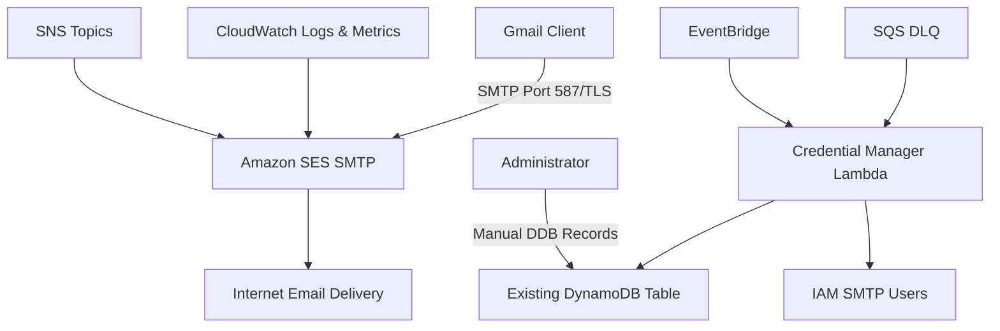

# Design Document

## Overview

This system provides outbound email sending capabilities by leveraging Amazon SES's built-in SMTP interface. Rather than implementing a custom SMTP server, we use SES's native SMTP endpoints and provide the necessary AWS infrastructure, credential management, and configuration documentation to enable users to configure Gmail and other email clients to send through SES.

The solution is entirely serverless, using only pay-per-use AWS services to avoid standing costs.

## Architecture

### High-Level Architecture



### Components

1. **Amazon SES SMTP Interface**: Native AWS service that handles SMTP protocol
2. **Existing DynamoDB Table**: Single-table design storing encrypted SMTP credentials
3. **Credential Manager Lambda**: Creates and manages IAM SMTP users (triggered by DDB changes)
4. **IAM Users**: Dedicated SMTP users with minimal SES permissions
5. **CloudWatch**: Native SES logging and monitoring
6. **SNS Topics**: Handle bounce and complaint notifications
7. **SQS Dead Letter Queues**: Handle failed Lambda processing
8. **EventBridge**: Trigger credential rotation

## Components and Interfaces

### Amazon SES Configuration

**SMTP Endpoints**: Regional SES SMTP endpoints (e.g., `email-smtp.us-east-1.amazonaws.com`)

- **Port 587**: STARTTLS (recommended for Gmail)
- **Port 465**: TLS Wrapper
- **Port 25**: STARTTLS (blocked by many ISPs)

**Required SES Setup**:

- Verified sending domains/addresses
- Production access (out of sandbox)
- Bounce and complaint handling via SNS

### Existing DynamoDB Table (Single-Table Design)

**Table Name**: Use existing table from ses-email-routing-modernization

**SMTP Credential Records**:

```json
{
  "PK": "SMTP_USER",
  "SK": "USER#{username}",
  "encrypted_password": "string (KMS encrypted)",
  "iam_user_arn": "string",
  "created_at": "timestamp",
  "status": "string (active|disabled|pending)",
  "description": "string",
  "allowed_from_addresses": ["*@example.com", "foo@domain.com", "specific@email.com"],
  "entity_type": "smtp_credential"
}
```

**Query Patterns**:

- Get specific user: `PK = "SMTP_USER" AND SK = "USER#{username}"`
- List all SMTP users: `PK = "SMTP_USER"`

**Email Restriction Integration**: Links to existing receiving rules structure to determine which email addresses each SMTP user can send from.

**Manual Record Creation**: Administrators manually insert records into DynamoDB table with `status: "pending"`. Lambda function detects new records and creates corresponding IAM users.

### Lambda Functions

#### Credential Manager (`smtp-credential-manager`)

**Purpose**: Automatically create IAM users and SMTP credentials when new records are added to DynamoDB

**Triggers**:

- DynamoDB Streams (when new SMTP credential records are inserted)

**Operations**:

- Detect new records with `status: "pending"`
- Create IAM user with restricted SES permissions based on allowed_from_addresses
- Generate SMTP credentials using SES API
- Encrypt and store credentials in DynamoDB
- Update record status to `"active"` or `"failed"`

**Email Validation Lambda (`smtp-email-validator`)**:
**Purpose**: Validate outbound emails against user restrictions

**Triggers**:

- SES sending events (via SNS/EventBridge)

**Operations**:

- Check sender address against user's allowed_from_addresses
- Log violations and optionally block future sends
- Update CloudWatch metrics for compliance monitoring

**Error Handling**:

- Failed operations sent to SQS Dead Letter Queue
- Retry logic with exponential backoff
- Structured error logging to CloudWatch with correlation IDs
- X-Ray tracing for all operations and AWS service calls

**Logging and Tracing**:

- X-Ray tracing enabled for all Lambda functions
- Structured JSON logging with correlation IDs
- Trace IAM operations, DynamoDB writes, and KMS calls
- Performance metrics and error tracking through X-Ray

**DLQ Processing**: Separate function to handle failed credential operations from DLQ

### IAM SMTP Users

**Purpose**: Each SMTP credential requires a dedicated IAM user because:

1. SES SMTP authentication uses IAM access keys (username/password)
2. Each user needs different email sending restrictions
3. Individual users enable granular permission control and auditing

**Naming Convention**: `ses-smtp-user-{username}-{timestamp}`

**Individual User Policy**: Each IAM user gets a unique inline policy based on their allowed email addresses

```json
{
  "Version": "2012-10-17",
  "Statement": [
    {
      "Effect": "Allow",
      "Action": [
        "ses:SendEmail",
        "ses:SendRawEmail"
      ],
      "Resource": "*",
      "Condition": {
        "StringLike": {
          "ses:FromAddress": ["john.doe@company.com", "*@marketing.company.com"]
        }
      }
    }
  ]
}
```

**Programmatic-Only Users**:

- IAM users created without console access (no login profile)
- Only programmatic access via access keys for SMTP authentication
- No password policy or MFA requirements needed
- Cannot be used to log into AWS console

**Access Key Management**:

- Lambda creates programmatic IAM user and generates access key pair
- Access key ID becomes SMTP username
- Secret access key is converted to SMTP password using SES algorithm
- Credentials are encrypted and stored in DynamoDB
- No console password or permissions are ever created

### Manual Administration Process

**Creating SMTP Credentials**:

1. Administrator manually inserts record into DynamoDB table:

```json
{
  "PK": "SMTP_USER",
  "SK": "USER#john.doe",
  "status": "pending",
  "description": "John Doe email access",
  "allowed_from_addresses": ["john.doe@company.com", "*@marketing.company.com"],
  "entity_type": "smtp_credential"
}
```

1. DynamoDB Stream triggers Lambda function
2. Lambda creates IAM user and SMTP credentials
3. Lambda updates record with encrypted credentials and status

**Disabling Credentials**:

- Update DynamoDB record status to "disabled"
- Lambda function detects change and disables IAM user

**Monitoring**: Use CloudWatch dashboards to view credential status and usage

## Data Models

### SMTP Credential Model

```typescript
interface SMTPCredential {
  username: string;                    // IAM access key ID
  encryptedPassword: string;           // KMS-encrypted SMTP password
  iamUserArn: string;                 // ARN of associated IAM user
  createdAt: Date;
  status: 'active' | 'disabled' | 'pending';
  description: string;
  allowedFromAddresses: string[];      // Email patterns user can send from
  entityType: 'smtp_credential';
}
```

### SQS Dead Letter Queue Model

```typescript
interface DLQMessage {
  originalEvent: DynamoDBStreamRecord;
  errorType: string;
  errorMessage: string;
  retryCount: number;
  timestamp: Date;
}
```

## Error Handling

### SES SMTP Error Mapping

- **Rate Limiting**: SES returns 454 (temporary failure) - client should retry
- **Invalid Recipients**: SES returns 550 (permanent failure)
- **Authentication Failures**: SES returns 535 (authentication failed)
- **Quota Exceeded**: SES returns 454 (temporary failure)

### Lambda Error Handling

- **Credential Creation Failures**: Update DynamoDB status to "failed", send to DLQ for retry
- **DynamoDB Failures**: Retry with exponential backoff, send to DLQ after max retries
- **KMS Failures**: Log securely, send to DLQ for manual intervention
- **IAM Failures**: Rollback partial operations, update status, send to DLQ

### Dead Letter Queue Processing

- **SQS DLQ**: Captures failed Lambda executions for manual review
- **DLQ Processor Lambda**: Attempts to reprocess failed operations
- **Manual Intervention**: CloudWatch alarms notify administrators of DLQ messages

### Native SES Monitoring

- **CloudWatch Metrics**: SES provides built-in metrics for sends, bounces, complaints
- **SES Event Publishing**: Configure SES to publish events to CloudWatch Logs
- **Bounce/Complaint Handling**: SNS topics for automated bounce processing

## Testing Strategy

### Unit Tests

- Lambda function logic for credential management
- Encryption/decryption operations
- Error handling scenarios

### Integration Tests

- End-to-end SMTP authentication flow
- SES sending with generated credentials
- Bounce and complaint handling

### Load Tests

- Credential creation under load
- DynamoDB performance with multiple concurrent operations

### Security Tests

- Credential encryption validation
- IAM permission verification
- API authentication testing

### Manual Tests

- Gmail configuration with generated credentials
- Email sending through various clients
- Administrative operations through API

## Configuration Documentation

### DNS and Security Setup

#### Domain Verification

**SES Domain Verification**:

1. Terraform outputs provide required TXT record for domain verification
2. Administrator adds TXT record to DNS
3. Terraform outputs provide 3 CNAME records for DKIM setup
4. Administrator adds CNAME records to DNS
5. SES automatically verifies domain and enables DKIM when records are detected

#### SPF Records

**Purpose**: Authorize SES to send emails on behalf of your domain

```dns
example.com. IN TXT "v=spf1 include:amazonses.com ~all"
```

#### DKIM Configuration

**Purpose**: Enable email signing for authenticity

- Terraform outputs provide 3 CNAME records for DKIM setup
- Records are region-specific and auto-generated by SES
- Administrator must manually add records to DNS for each sending domain
- SES automatically enables DKIM signing once records are verified

#### DMARC Policy

**Purpose**: Define policy for email authentication failures

```dns
_dmarc.example.com. IN TXT "v=DMARC1; p=quarantine; rua=mailto:dmarc@example.com; ruf=mailto:dmarc@example.com; sp=quarantine; adkim=r; aspf=r;"
```

#### MTA-STS Setup

**Purpose**: Enforce TLS for email delivery

1. Create MTA-STS policy file
2. Add DNS TXT record for MTA-STS
3. Host policy file on HTTPS endpoint

#### TLS-RPT Configuration

**Purpose**: Receive reports about TLS failures

```dns
_smtp._tls.example.com. IN TXT "v=TLSRPTv1; rua=mailto:tls-reports@example.com;"
```

### Gmail SMTP Configuration

**Server Settings**:

- SMTP Server: `email-smtp.{region}.amazonaws.com`
- Port: 587
- Security: STARTTLS
- Authentication: Username/Password (from SES SMTP credentials)

**Steps**:

1. Obtain SMTP credentials from administrator
2. Configure Gmail SMTP settings
3. Test sending with authorized from address
4. Verify delivery and check logs

### Outlook Configuration

**Server Settings**: Same as Gmail
**Authentication**: Use SES SMTP credentials
**Security**: Ensure STARTTLS is enabled

### Thunderbird Configuration

**Server Settings**: Same as Gmail
**Authentication**: Use SES SMTP credentials
**Port Configuration**: 587 with STARTTLS

## Security Considerations

### Credential Security

- All SMTP passwords encrypted at rest using KMS
- IAM users have minimal required permissions
- Regular credential rotation capability
- Audit logging of all credential operations

### Network Security

- All SMTP connections use TLS encryption
- No custom network infrastructure required
- Leverage SES's built-in security features

### Access Control

- Admin API requires IAM authentication
- Separate IAM roles for different operations
- CloudTrail logging of all API calls

## Deployment Architecture

### Terraform Modules

- SES configuration (domains must be verified externally)
- DynamoDB Streams on existing table
- Lambda functions with proper IAM roles and DLQ configuration
- SQS Dead Letter Queues
- CloudWatch dashboards and alarms
- SNS topics for bounce/complaint notifications

### Terraform Outputs

- Required DNS records for domain verification
- Required DNS records for DKIM setup
- SES SMTP endpoint URLs
- Recommended SPF, DMARC, and MTA-STS records
- SNS topic ARNs for bounce/complaint handling

### Environment Variables

- KMS key ARN for encryption
- DynamoDB table name
- SES region configuration
- SNS topic ARNs
- X-Ray tracing configuration
- Log level configuration

### Lambda Configuration

- X-Ray tracing enabled for all functions
- Structured logging with JSON format
- Correlation ID generation for request tracking
- CloudWatch log retention policies

### Dependencies

- Existing AWS account with SES access
- KMS key for encryption
- IAM permissions for resource creation
